# The Zoo

The Zoo is a simulated web environment. It's meant to be complex enough for true end-to-end testing (like the live web), while being reproducible (unlike the live web).

Web services are hosted on the `.zoo` domain accessible through a forward proxy.

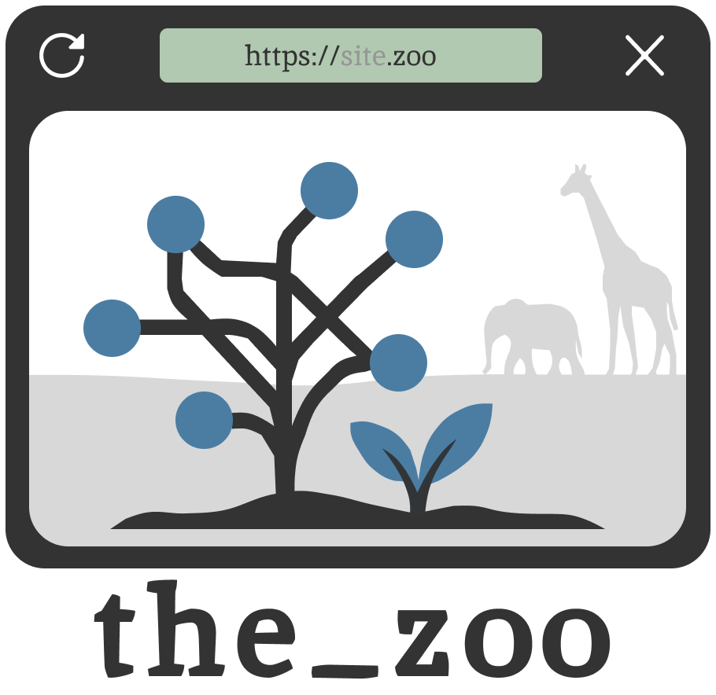

[Paper](https://madweb.work/papers/2026/madweb26-paper35.pdf) · [Installation](#installation) · [Available Sites](#available-sites)

## Installation

The Zoo needs [Node](https://nodejs.org/en/download/) 22.9+, [Docker Engine](https://docs.docker.com/engine/install/) 25+ with [Compose](https://docs.docker.com/compose/install/) 2.24.4+, ~8 GB of memory for Docker and roughly 75 GB of disk for a checkout (`npm start` builds everything and pulls the heavy apps); `npx the_zoo start` needs ~15 GB (~35 GB with `--with-heavy`). `npm run cli -- doctor` checks these.

```bash
npm install
npm start
```

To upgrade a checkout, pull and run `npm install && npm run stop && npm start`. `npm run reset` is now `npm run cli -- reset`.

For targeted live tests, `npm run test:focused -- tests/sites/misc-api.test.ts` skips the suite-wide on-demand app warm-up. Use `npm test` for the full suite and for `tests/integration/on-demand-start.test.ts`, which needs the cold-start probe.

Without a checkout, the npm package runs the published images: `npx the_zoo start` (`--with-heavy` adds onestopshop.zoo and postmill.zoo).

For install/start issues, see [here](#troubleshooting).

### Core Services

- **Squid Proxy** (Port 3128) - HTTP proxy for host browser access
- **CoreDNS** - DNS for all containers; resolves `.zoo` domains from the compose `zoo.domains` labels
- **Caddy** - Reverse proxy and static file server. Also handles SSL, with private keys committed for reproducibility.
- **PostgreSQL**, **MySQL** - Restore their [golden state](docs/golden-state.md) on every start, except after a crash
- **Redis** - Key-value store
- **Stalwart** - Mail server ([GitHub](https://github.com/stalwartlabs/mail-server))
- **Hydra** - OAuth2/OpenID Connect server ([Ory Hydra](https://github.com/ory/hydra))

### Sites

- **Apps** - Compose services with a `zoo.domains` label; custom images live in `sites/apps/`
- **Static Sites** - Located in `sites/static/`, served directly by Caddy
- **Zoo Sites** - The published [zoo-sites](https://github.com/bgrins/zoo-sites) image serves 66 simulated sites, including `voltro.zoo`, `nimbrel.zoo`, and `drennhill-dental.zoo`. They share one on-demand container with in-memory state that resets on restart. `EVAL_SEED=zoo` pins the difficulty draws; session identifiers remain random.

To update Zoo Sites, pin a published tag (by digest) in `docker-compose.yaml`, copy the domain mappings from that commit's `docker/zoo-snippet.yaml`, update `core/zoo-sites-titles.json`, add a Matomo site for each new domain ([docs/analytics.md](docs/analytics.md#adding-a-site)), run `npm run generate-config`, recreate `zoo-sites` and restart `caddy` and `coredns`.

## Setup instructions for manual browsing

`npm run browse` opens a configured Playwright Firefox (run `npx playwright install firefox` first; on Linux, `npx playwright install --with-deps firefox`). The `zoo-playwright` MCP server in `.mcp.json` needs its own: `npx playwright-mcp install-browser firefox`. It uses the published proxy port of the running Zoo instance; if several are running, set `ZOO_BROWSER_INSTANCE` to an instance ID or Compose project name before launching the MCP server. Run `npm run cli -- status --json` to see available instances. For a normal Firefox:

1. Create a new profile (about:profiles) and copy [`docs/firefox-profile/user.js`](./docs/firefox-profile/user.js) into its folder (about:support shows it). It sets the proxy (localhost:3128) and `.zoo` handling.
2. Import [`core/caddy/root.crt`](./core/caddy/root.crt) under about:preferences#privacy → Certificates → View Certificates, and trust it for websites.
3. Restart Firefox.

## Credentials

Per-app logins for every persona are in [`docs/credentials/`](./docs/credentials/).

## Available Sites

### Applications Gallery

| Screenshot                                                                          | Site                                       | Description                                               |
| ----------------------------------------------------------------------------------- | ------------------------------------------ | --------------------------------------------------------- |
| 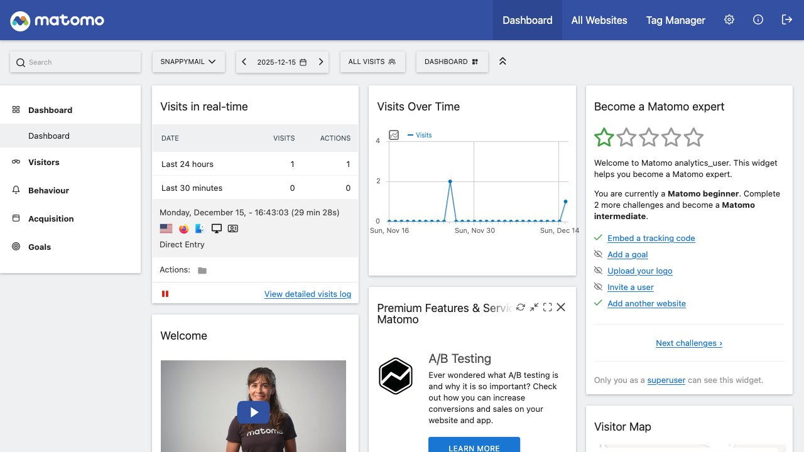     | [analytics.zoo](https://analytics.zoo)     | Web analytics platform powered by Matomo                  |
| 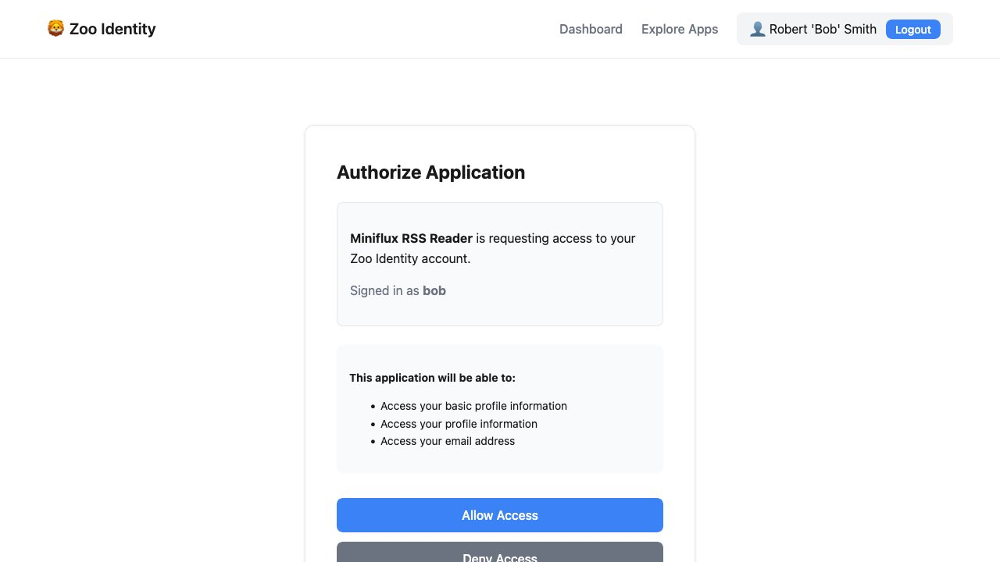               | [auth.zoo](https://auth.zoo)               | Single sign-on for the zoo's apps                         |
| 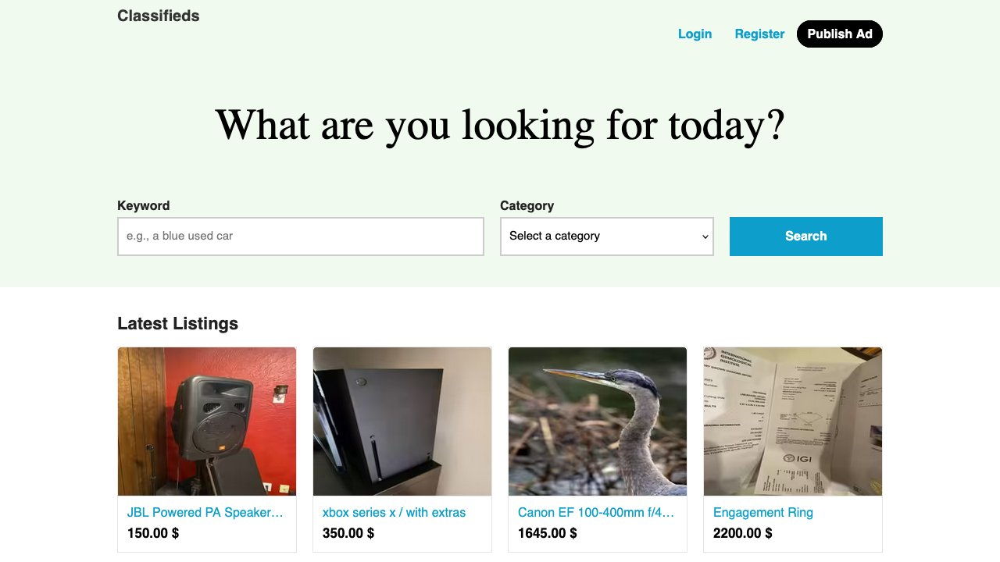 | [classifieds.zoo](https://classifieds.zoo) | Classified ads marketplace from VisualWebArena            |
| 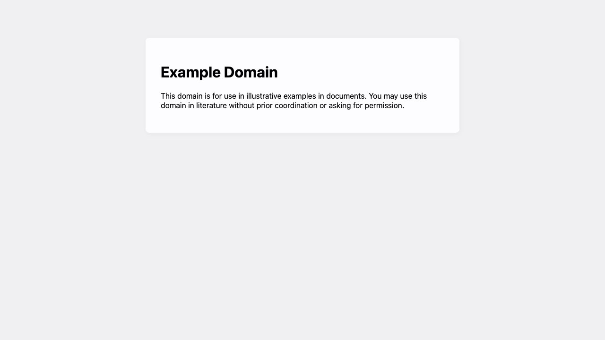         | [example.zoo](https://example.zoo)         | Static example site                                       |
| 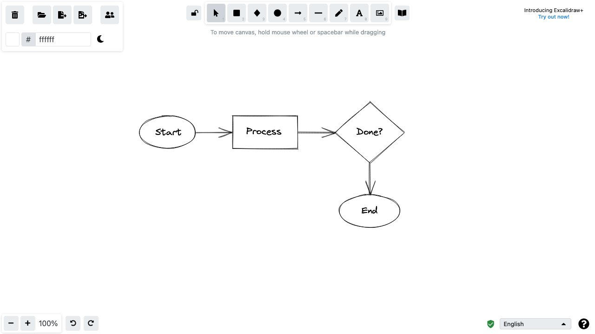   | [excalidraw.zoo](https://excalidraw.zoo)   | Virtual whiteboard for sketching diagrams                 |
| 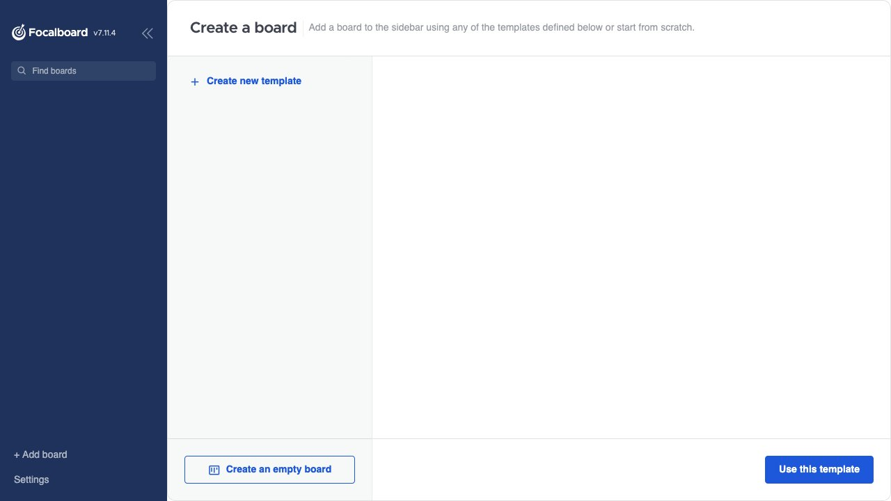   | [focalboard.zoo](https://focalboard.zoo)   | Open source project management and kanban boards          |
| 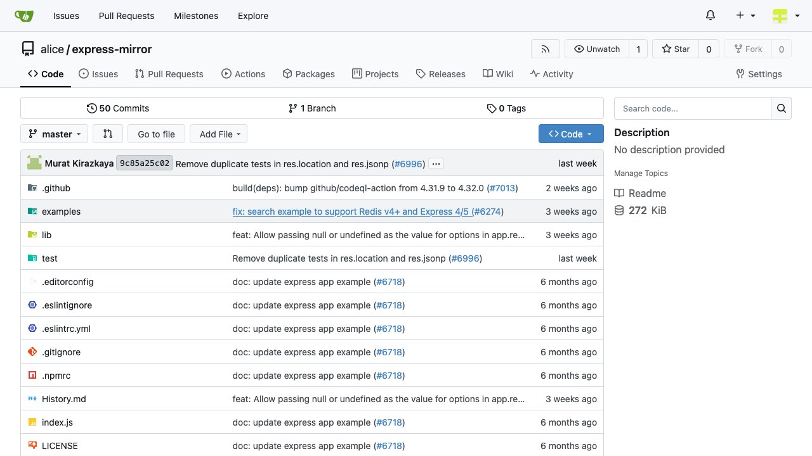             | [gitea.zoo](https://gitea.zoo)             | Self-hosted Git service with web interface                |
| 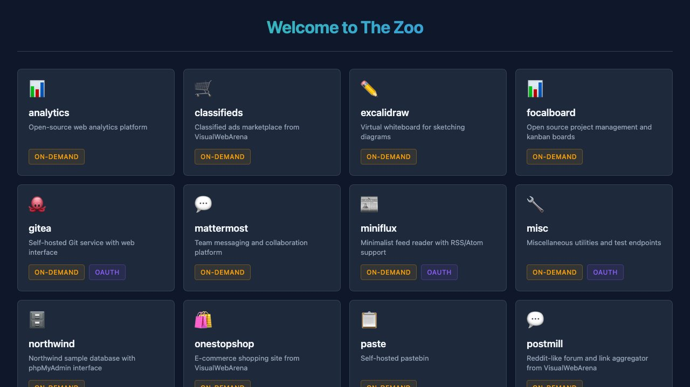               | [home.zoo](https://home.zoo)               | Directory of every zoo site                               |
| 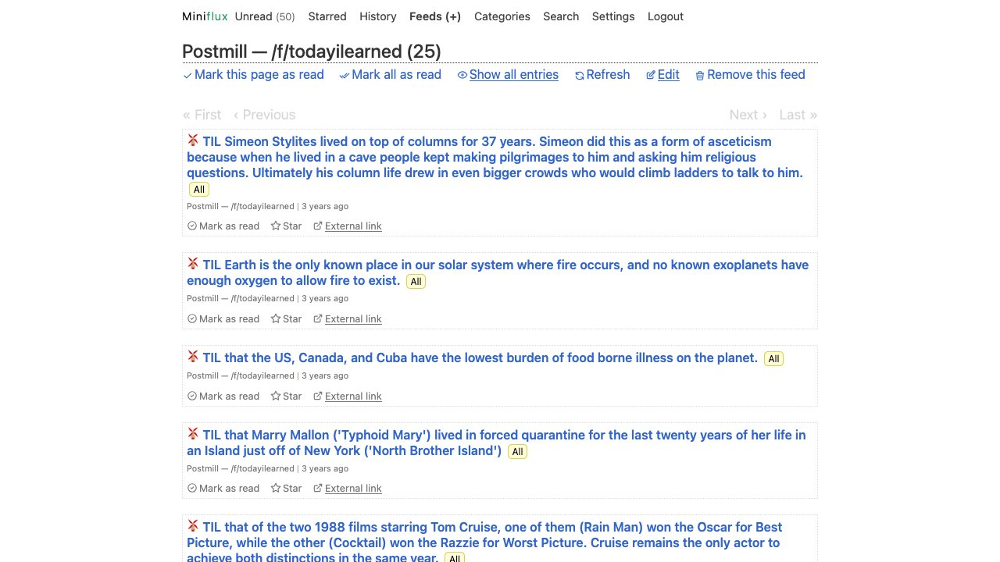       | [miniflux.zoo](https://miniflux.zoo)       | Minimalist feed reader with RSS/Atom support              |
| 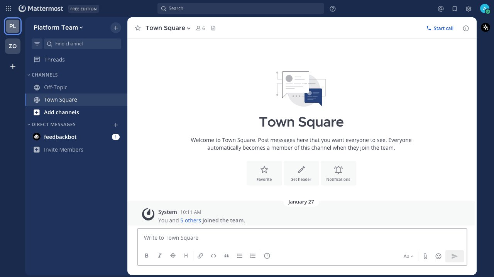   | [mattermost.zoo](https://mattermost.zoo)   | Team messaging and collaboration platform                 |
| 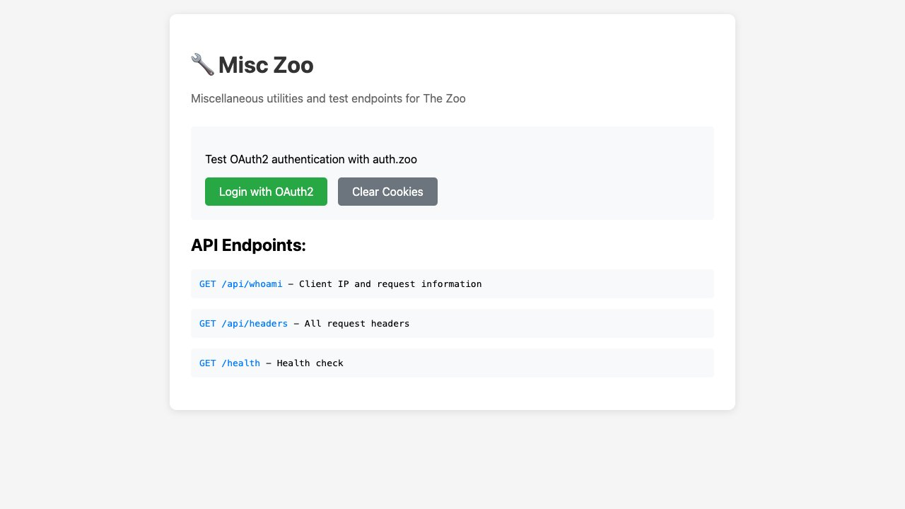               | [misc.zoo](https://misc.zoo)               | Miscellaneous utilities and test endpoints                |
| 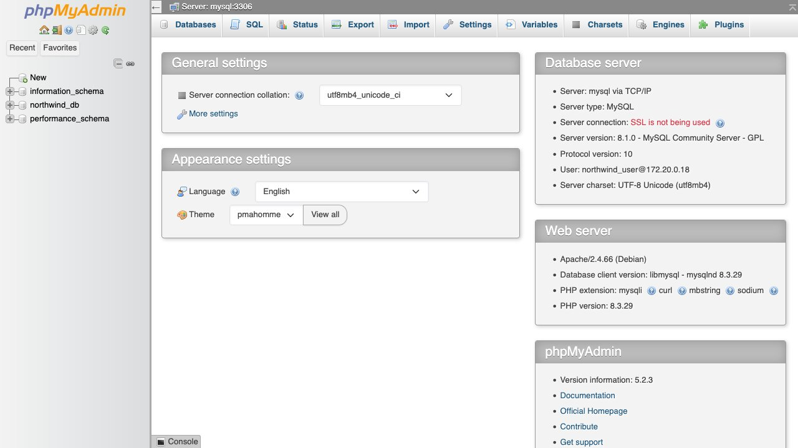     | [northwind.zoo](https://northwind.zoo)     | Northwind sample database with phpMyAdmin interface       |
| 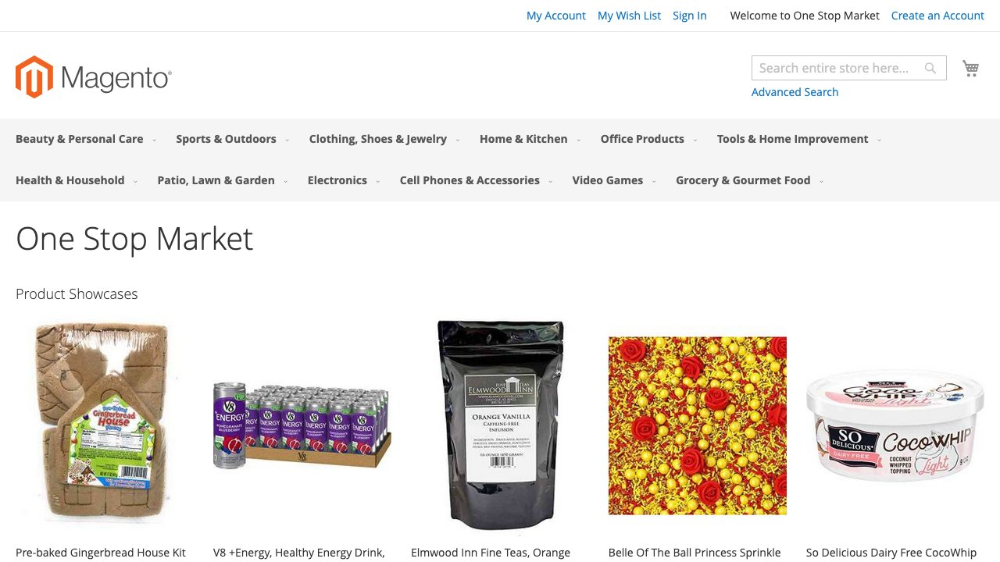 | [onestopshop.zoo](https://onestopshop.zoo) | E-commerce shopping site from VisualWebArena              |
| 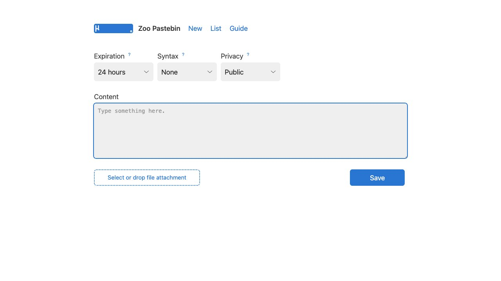             | [paste.zoo](https://paste.zoo)             | Self-hosted pastebin                                      |
| 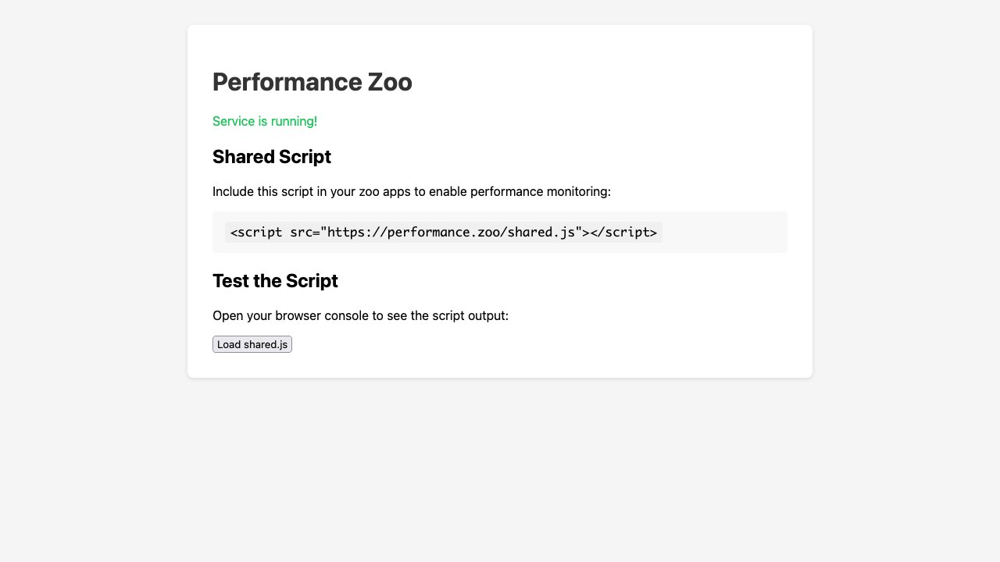 | [performance.zoo](https://performance.zoo) | Performance testing and monitoring tools                  |
| 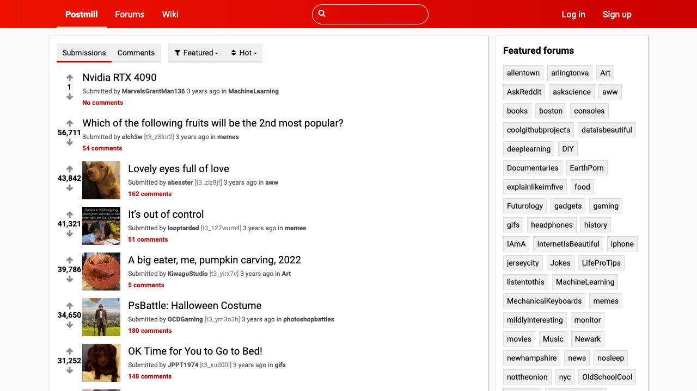       | [postmill.zoo](https://postmill.zoo)       | Reddit-like forum and link aggregator from VisualWebArena |
| 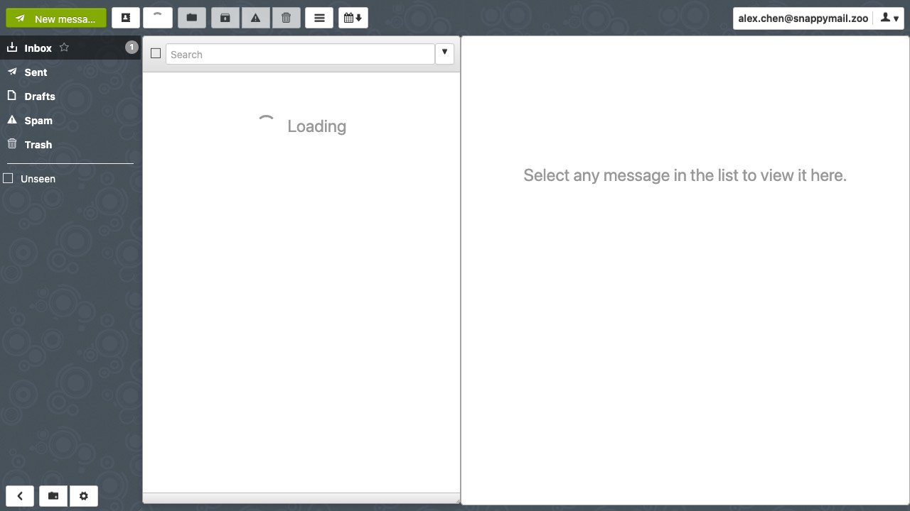   | [snappymail.zoo](https://snappymail.zoo)   | Modern webmail client with clean interface                |
| 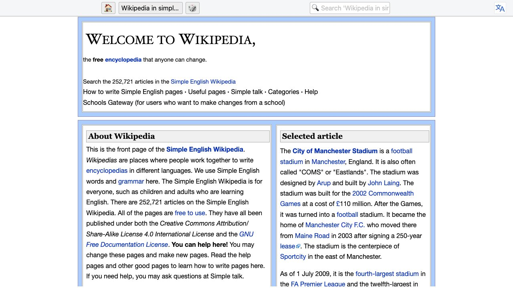               | [wiki.zoo](https://wiki.zoo)               | Offline Wikipedia reader and knowledge base               |

The 65 [Zoo Sites](#sites) domains are listed on [home.zoo](https://home.zoo) and in [`core/SITES.yaml`](core/SITES.yaml).

## Troubleshooting

If a build fails with `wget: unable to resolve host address 'dl-cdn.alpinelinux.org'`, give Docker a DNS server in `/etc/docker/daemon.json`:

```json
{
  "dns": ["8.8.8.8", "1.1.1.1"]
}
```

Then restart Docker:

```bash
sudo systemctl restart docker
```

If a start fails with `Pool overlaps with other one on this address space`, another Docker network holds the Zoo's subnets: set `ZOO_SUBNET`, `ZOO_PUBLIC_SUBNET` and the `ZOO_*_IP` values in `.env` (see [`.env.example`](.env.example)).
